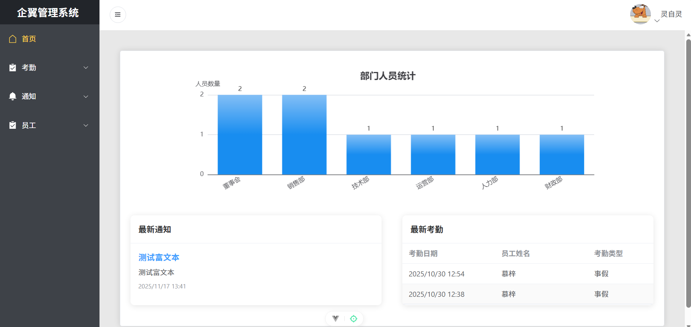
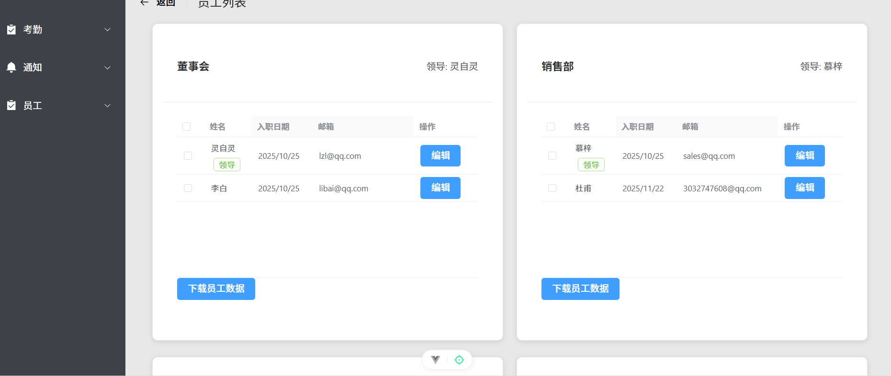
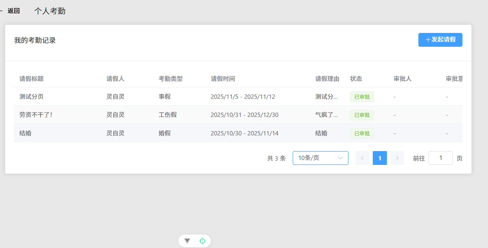

# 办公自动化系统 (OA System)

这是一个前后端分离的办公自动化系统，包含后端(Django)和前端(Vue 3)两部分，提供用户认证、考勤管理、员工管理和通知管理等功能。

## 项目概述

本系统旨在为企业提供高效的办公自动化解决方案，通过前后端分离架构，实现了完整的办公流程管理功能。后端基于Django REST Framework提供RESTful API，前端基于Vue 3构建现代化的用户界面。

## 技术栈

### 后端技术栈
- **后端框架**：Django 5.2.6 + Django REST Framework
- **数据库**：MySQL
- **缓存**：Redis
- **异步任务**：Celery
- **认证机制**：JWT (JSON Web Token)
- **跨域支持**：CORS
- **邮件服务**：SMTP (QQ邮箱)

### 前端技术栈
- **前端框架**: Vue 3 + Vue Router 4
- **状态管理**: Pinia
- **UI组件库**: Element Plus (基于Vue 3)
- **构建工具**: Vite
- **HTTP客户端**: Axios
- **富文本编辑器**: WangEditor
- **图表库**: ECharts
- **CSS框架**: Bootstrap
- **代码格式化**: Prettier

## 项目运行结果展示




## 功能模块

### 1. 用户认证系统 (officeAuth)
- 用户注册、登录、登出
- JWT令牌管理
- 用户信息管理
- 部门管理

### 2. 考勤管理系统 (officeAttendance)
- 请假申请
- 审批流程
- 考勤记录查询

### 3. 员工管理系统 (staff)
- 员工信息的增删改查
- 批量数据导出
- 异步邮件通知

### 4. 文件管理系统 (file)
- 文件上传下载
- 文件分类管理

### 5. 通知系统 (inform)
- 通知发布
- 部门通知可见性控制
- 通知阅读状态跟踪

### 6. 首页功能 (home)
- 最新通知展示
- 最新考勤记录
- 部门人员统计

## 项目结构

### 整体项目结构
```
OAProject/
├── DjangoOfficeProject/  # 后端项目目录
└── oa-vue-project/       # 前端项目目录
```

### 后端项目结构
```
DjangoOfficeProject/
├── DjangoOfficeProject/         # 项目主配置目录
│   ├── __init__.py              # 初始化文件，包含Celery应用初始化
│   ├── asgi.py                  # ASGI配置文件
│   ├── celery.py                # Celery配置文件
│   ├── settings.py              # Django主配置文件
│   ├── urls.py                  # 主URL路由配置
│   └── wsgi.py                  # WSGI配置文件
├── apps/                        # 应用模块目录
│   ├── file/                    # 文件管理模块
│   ├── home/                    # 首页功能模块
│   ├── inform/                  # 通知管理模块
│   ├── officeAttendance/        # 考勤管理模块
│   ├── officeAuth/              # 用户认证模块
│   └── staff/                   # 员工管理模块
├── media/                       # 媒体文件存储目录
├── templates/                   # HTML模板目录
├── logs.log                     # 日志文件
├── manage.py                    # Django管理脚本
└── README.md                    # 后端项目说明文档
```

### 前端项目结构
```
oa-vue-project/
├── src/
│   ├── api/            # API请求封装
│   ├── assets/         # 静态资源
│   │   ├── css/        # CSS样式文件
│   │   ├── img/        # 图片资源
│   │   └── js/         # JS文件
│   ├── components/     # 公共组件
│   ├── router/         # 路由配置
│   ├── stores/         # Pinia状态管理
│   ├── views/          # 页面组件
│   ├── App.vue         # 根组件
│   └── main.js         # 入口文件
├── .env.development    # 开发环境配置
├── .env.production     # 生产环境配置
├── index.html          # HTML入口文件
├── package.json        # 项目依赖配置
└── vite.config.js      # Vite配置文件
```

## 后端模块职责表

| 模块名称 | 主要职责 | 文件位置 | 核心文件 |
|---------|---------|---------|--------|
| 用户认证 | 用户登录注册、JWT认证管理 | apps/officeAuth/ | apps/officeAuth/views.py |
| 考勤管理 | 请假申请、审批流程、考勤记录 | apps/officeAttendance/ | apps/officeAttendance/views.py |
| 员工管理 | 员工信息管理、异步邮件通知 | apps/staff/ | apps/staff/views.py |
| 文件管理 | 文件上传下载、分类管理 | apps/file/ | apps/file/views.py |
| 通知系统 | 通知发布、阅读状态跟踪 | apps/inform/ | apps/inform/views.py |
| 首页功能 | 数据统计、信息展示 | apps/home/ | apps/home/views.py |

## 环境要求

### 后端环境要求
- Python 3.8+
- MySQL 5.7+
- Redis 6.0+

### 前端环境要求
- Node.js: ^20.19.0 或 >=22.12.0
- npm: 推荐使用最新版本

## 快速开始

### 1. 克隆项目

```bash
git clone https://github.com/RMA-MUN/DjangoOaSystem
cd OAProject
```

### 2. 后端配置与启动

#### 2.1 创建并激活虚拟环境

```bash
# Windows
cd DjangoOfficeProject
python -m venv venv
venv\Scripts\activate

# macOS/Linux
cd DjangoOfficeProject
python3 -m venv venv
source venv/bin/activate
```

#### 2.2 安装后端依赖

```bash
# 安装依赖
pip install -r requirements.txt
```

#### 2.3 配置数据库

确保MySQL已安装并运行，然后在`DjangoOfficeProject/settings.py`中配置数据库连接信息：

```python
DATABASES = {
    'default': {
        'ENGINE': 'django.db.backends.mysql',
        'NAME': 'django_oa',  # 数据库名
        'USER': 'root',       # 用户名
        'PASSWORD': 'your_password',  # 密码
        'HOST': 'localhost',  # 主机
        'PORT': '3306',       # 端口
    }
}
```

#### 2.4 配置邮箱服务（用于用户激活）

在`DjangoOfficeProject/settings.py`中配置邮件服务信息：

```python
# 邮件配置
EMAIL_BACKEND = 'django.core.mail.backends.smtp.EmailBackend'
EMAIL_HOST = 'smtp.qq.com'  # QQ邮箱SMTP服务器
EMAIL_PORT = 587  # SMTP端口
EMAIL_USE_TLS = True  # 使用TLS加密
EMAIL_HOST_USER = 'your_email@qq.com'  # 发送邮件的邮箱地址
EMAIL_HOST_PASSWORD = 'your_email_password'  # 邮箱授权码（非登录密码）
DEFAULT_FROM_EMAIL = EMAIL_HOST_USER  # 默认发件人

# 激活邮件设置
ACTIVATION_EXPIRE_DAYS = 7  # 激活链接有效期（天）
```

#### 2.5 初始化数据库

```bash
python manage.py migrate
```

#### 2.6 启动Redis服务

确保Redis已安装并运行：

```bash
# Windows (通过Redis CLI)
redis-server.exe

# macOS/Linux
redis-server
```

#### 2.7 启动Celery Worker

在项目根目录下打开新的终端窗口，运行：

```bash
# Windows
celery -A DjangoOfficeProject worker -l INFO -P gevent -Q celery,email

# macOS/Linux
celery -A DjangoOfficeProject worker -l info
```

#### 2.8 启动Django开发服务器

```bash
python manage.py runserver
```

后端服务将运行在 http://127.0.0.1:8000

### 3. 前端配置与启动

#### 3.1 安装前端依赖

```bash
# 在OAProject目录下
cd oa-vue-project
npm install
# 或使用yarn
yarn install
```

#### 3.2 配置开发环境

根据需要修改`.env.development`文件中的配置，主要是API接口地址：

```
VITE_API_BASE_URL=http://127.0.0.1:8000
```

#### 3.3 启动前端开发服务器

```bash
npm run dev
# 或使用yarn
yarn dev
```

前端服务将运行在 http://127.0.0.1:3000

## API文档

系统各模块的API端点：

- 用户认证：`/officeAuth/`
- 考勤管理：`/Attendance/`
- 员工管理：`/staff/`
- 文件管理：`/file/`
- 通知管理：`/inform/`
- 首页功能：`/home/`

## 开发说明

### 后端开发

- 异步任务处理：使用Celery处理异步邮件发送等耗时操作
- 认证机制：基于JWT的身份认证，所有需要认证的API请求需要在请求头中包含有效的JWT令牌
- 数据库模型：遵循Django ORM设计规范

### 前端开发

- 代码规范：使用Prettier进行代码格式化
- 组件化开发：将UI拆分为可复用的组件
- 状态管理：使用Pinia管理应用状态

### 代码格式化

```bash
# 前端代码格式化
cd oa-vue-project
npm run format
# 或使用yarn
yarn format
```

## 注意事项

1. 开发环境中，确保后端DEBUG模式设置为True，便于调试
2. 生产环境部署时，务必关闭DEBUG模式并设置正确的ALLOWED_HOSTS
3. 定期备份数据库和媒体文件
4. 对于生产环境，建议配置HTTPS确保数据传输安全
5. 合理配置Redis内存上限，避免内存溢出
6. 前端生产环境配置在.env.production文件中
7. 前端构建后的文件位于dist目录下

## 项目亮点

1. **前后端分离架构**：采用Django + Vue 3的前后端分离架构，提高开发效率和系统可维护性
2. **异步任务处理**：使用Celery实现异步邮件发送和耗时操作，提高系统响应速度
3. **完善的权限控制**：基于JWT的认证机制，确保API访问安全
4. **模块化设计**：清晰的功能模块划分，便于维护和扩展
5. **现代化前端界面**：基于Vue 3和Element Plus构建响应式、美观的用户界面
6. **多模块协同**：考勤、员工、通知等模块紧密集成，实现办公流程自动化
7. **文件管理**：支持文件上传下载和分类管理，满足办公需求

## 许可证

[MIT License](LICENSE)
